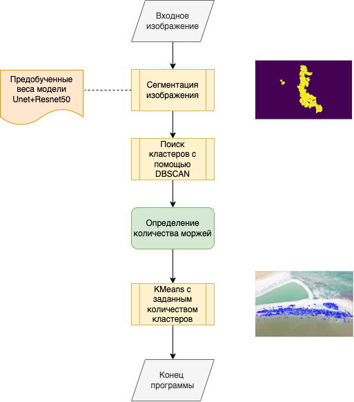
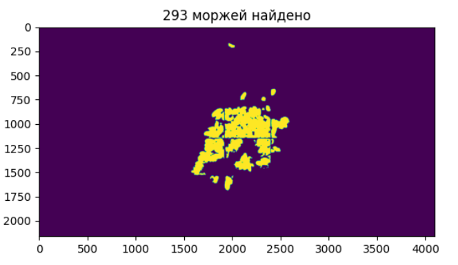
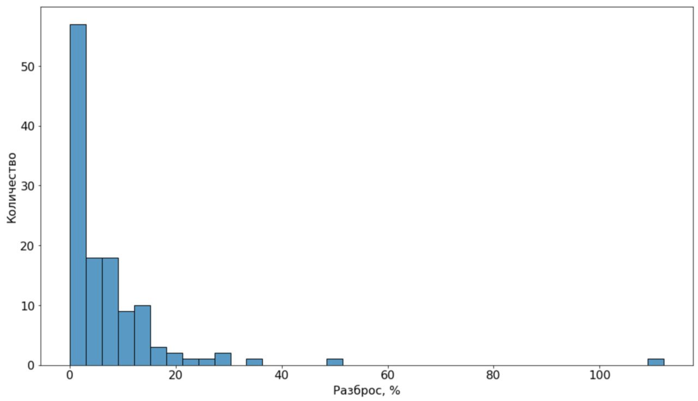

<h1 style="text-align: center"> Подсчет количества моржей с фотографий летательных аппаратов </h1>

<p style="text-align: center">
Алгоритм базируется на семантической сегментации (resnet18 + Unet) изображения, которая обучена на 16000 фотографий моржей.
Далее проводится кластерный анализ над сегментированным изображением. Средний разбос данного метода составляет 4% от количества особей.
</p> 


## Ответы

Ответы в виде csv файлов хранятся в архиве спам.zip.


## Применение алгоритма

Нужно скачать [веса для модели сегментации](https://drive.google.com/file/d/1o1eAUDSw4e-1FJxW30CvXoi02xZWZs66/view?usp=sharing). Далее перекинуть скачанный файл в папку models.

Затем нужно запустить следующий код
```python
import cv2
from counting import get_walrus_count

img = cv2.imread('examples/morz.jpeg')
animal_count = get_walrus_count(img)

print(animal_count)
```


## Принцип работы

Работа разделяется на три этапа:




### Сегментация

Было принято применить семантическую сегментацию, потому что искомых объектов на фото может быть
очень много, что не помещается в обычное ОЗУ или GPU.
В качестве модели была использована архитектура Unet с сверточными слоями от resnet18.
Unet хорошо себя показал на подобных задачах, а resnet мало весит и быстро будет работать. 
Так же есть версия от resnet50, если в руках есть GPU.

Переданные изображения лежбищ моржей были разделены на участки 300x300, что позволило увеличить
датасет от 125 до 20 тысяч изображений. Во время обучения были применены практики аугментации и
предобработки для избежания переобучения сети. 

Примеры работы модели на контрольной выборке можно увидеть снизу:



### Расчет количества особей

Была выдвинута гипотеза, что объекты с большой высоты имеют одинаковую площадь. Поэтому было
предпринято решение считать количество особей как отношение между общей площадью найденных
особей к некоторой площади одной особи.

Данный алгоритм был реализован с помощью метода кластеризации DBSCAN(eps=1). С помощью найденных
кластеров и их свойств, была реализована модель случайного леса (RandomForestRegression), которая
решает задачу поиска количества особей.

Предложенный алгоритм показал размах в размере 4% от общего количества моржей на фото.




### Поиск отдельных моржей

Для этого проводится разделение точек моржей на рассчитанное количество особей с помощью KMeans.
Центры кластеров будут считаться за моржами.


## Обратная связь

- Телеграм: @loalkota
- Почта: egorovmichil9@gmail.com
